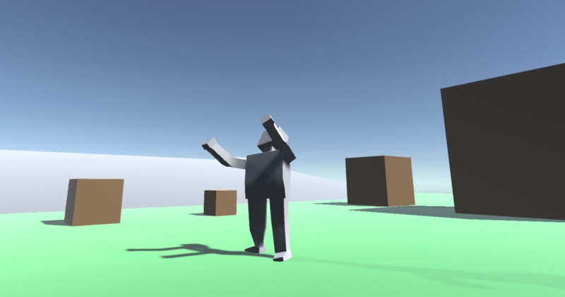

# Active Ragdolls in Unity

Ragdolls that physically play animations through the use of joints and rigid bodies.
Made with Unity v2020.1.9f1.

## Getting Started

You just need to clone or download this repository and open the project with Unity.
It's made in Unity v2020.1.9f1, but other versions will surely work fine, especially
newer ones.

## Guide of use

Active ragdolls are quite messy to make. To avoid as much pain as possible and
keep everything under control, I made a simple architecture that makes it all
more maintainable and understandable.

### Structure
An Active Ragdoll is a ragdoll that can apply forces to move itself. In this case
the Active Ragdoll tries to replicate animations through the use of joints
that target the rotations of an animation. The structure of an Active Ragdoll
is the following:

- A parent GameObject that encapsulates two bodies, one plays standard animations
and the other one is the ragdoll that tries to follow it with physics. This parent
object contains the main ActiveRagdoll script, the basic code block to which
Modules can be attached. Those modules contain independent functionalities
which allow the character to perform different actions. A behavior script
is also attached to this GameObject (this is all better explained in the next
section).

- An animated body. This is just a standard animated character, whose animation
will be physically copied by the ragdoll. The actual model is disabled because
we do not want to see it, we want to see only the ragdoll. But disabling it
stops animations from being played, so the animation mode of the Animator component
must be changed to 'Always animate'.

- A physical body. This is a duplicate of the animated body, but with some major
variations. First of all, the animator is still there, so certain functionality
can still be used (such as getting the transforms of certain body parts), but
it doesn't play any animation. The objects that comprise the body (left forearm,
right thigh, neck...) are each given a RigidBody and connected among themselves
by ConfigurableJoints, becoming what's essentially a ragdoll. All the ConfigurableJoints
are then set up to apply torque to reach a certain rotation (these are called
Angular Drives and Target Rotation). This rotation is set to be that of its
equivalent body part from the animated body previously described. For example,
the left forearm joint target rotation will be set to the animated forearm
rotation. This way every joint will target its animated peer rotation, replicating
the original animation with physical movement.

### Code
In terms of code, the behavior of the Active Ragdoll is divided into modules.
This allows different functionalities to be completely independent to one another,
and makes the code much easier to maintain. The code architecture can be described
as follows:

- A script 'ActiveRagdoll' that acts as the main pillar of the rest of the code.
It contains very basic functionality, the least possible that allows the rest
of the modules to work together.

- Modules are just scripts that contain a specific functionality. They are
completely independent from each other, and can be easily attached and detached.
It's important to remember that they do not do anything by themselves, they
provide function, not behavior. For that we need the following script.

- A behavior script attached to the parent GameObject. It tells the ActiveRagdoll
what to do: what input to take, what actions should be taken in what situations,
how to react to a specific environment change... To understand it better: ActiveRagdoll
and its modules act like an API, this script is used to control that API.

## Built With

* [Unity](https://unity.com/) (v2020.1.9f1)

## Contributing

Please read [CONTRIBUTING.md](_doc/CONTRIBUTING.md) for details on our code of conduct, and the process for submitting pull requests to us.

## Authors

* **[Sergio Abreu García](https://sag-dev.com)**

See also the list of [contributors](https://github.com/sergioabreu-g/active-ragdolls/contributors) who participated in this project.

## License

This project is licensed under the Apache 2.0 License - see the [LICENSE](LICENSE) file for details.

## Acknowledgments

* [MetallCore999](https://www.youtube.com/channel/UCB20-wZ22vU9tTieg6_Bx9g) for inspiration.
* [Michael Stevenson](https://github.com/mstevenson) for its Configurable Joint Extensions script.
